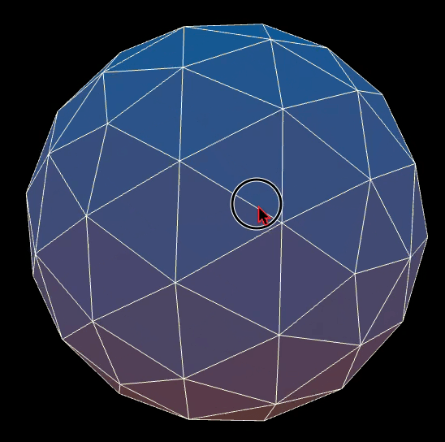

# threejs-sketches

There are **different** `index-....js` files imported in `index.html`. Uncomment the script you want to view and leave the others commented out. Ensure that only one script is uncommented at a time to avoid conflicts. 

[YouTube Tutorial](https://www.youtube.com/watch?v=UMqNHi1GDAE&t=11s) on how to get started with Three.js **by** [Bobby Roe](https://github.com/bobbyroe).

# Geometry

# Earth

# Wormhole

[Earth textures from Planet Pixel Emporium](https://planetpixelemporium.com/earth.html)

